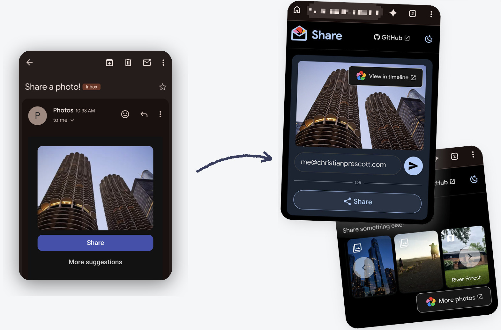

# Immich Share Prompter

Periodically send Immich users a notification encouraging them to share a recent photo from your library. This project is a companion to [Immich](https://github.com/immich-app/immich).




## Developing

Once you've created a project and installed dependencies with `npm install` (or `pnpm install` or `yarn`), start a development server:

```sh
docker compose build dev
docker compose up
```

## Building

To create a production version of your app:

```sh
npm run build
```

You can preview the production build with `npm run preview`.

> To deploy your app, you may need to install an [adapter](https://svelte.dev/docs/kit/adapters) for your target environment.

## License

This project is published under the AGPL-3.0 license because it depends on `@immich/sdk`'s API client.
